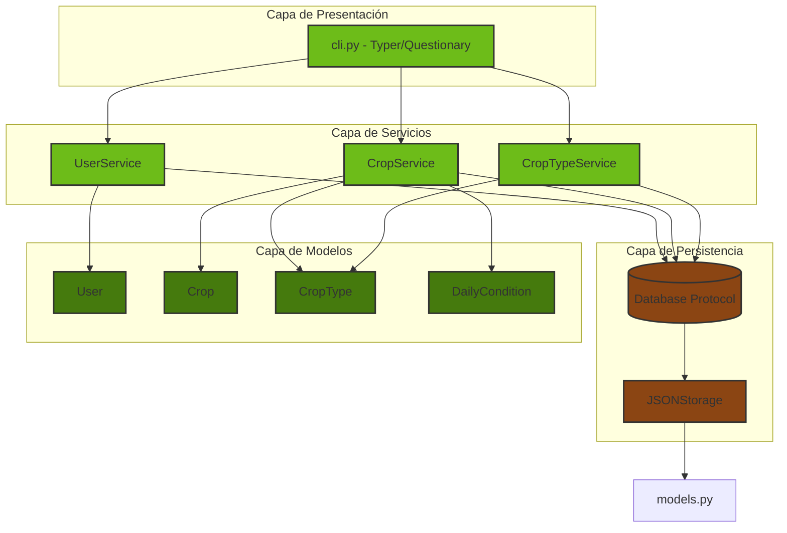
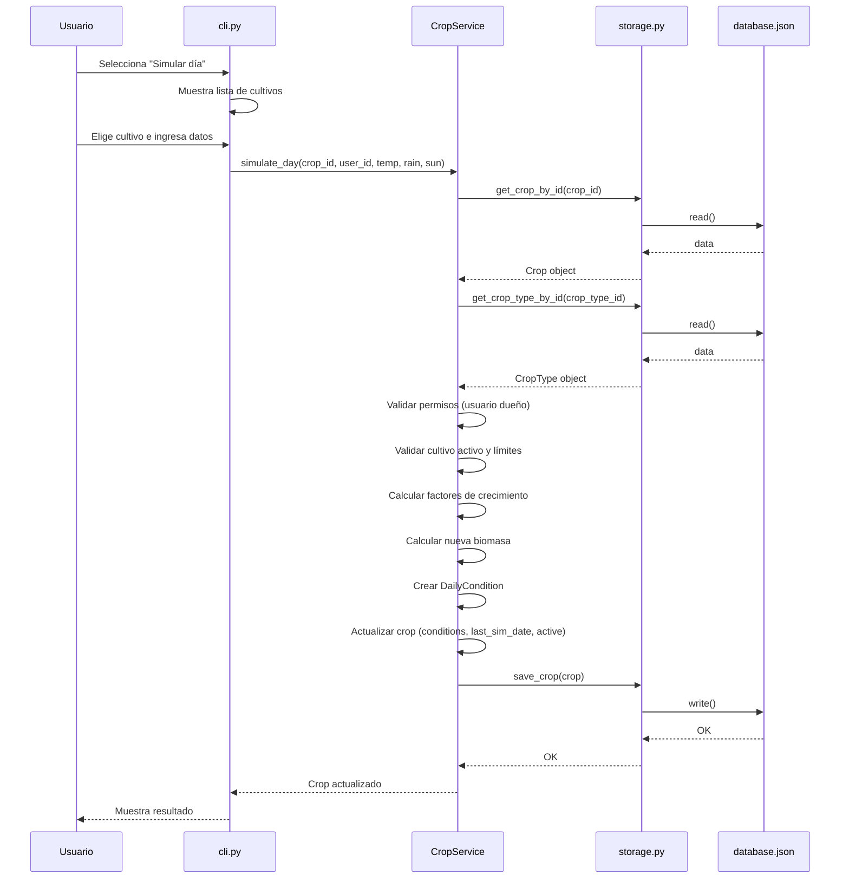

# **Arquitectura del Sistema**

<p align="center">
  
</p>
  
<div align="center">
  
  
  
</div>

---

## **Visión General de la Arquitectura**

CultivaLab está construido siguiendo los principios de la <span style="color: #6dbc19;">**arquitectura limpia**</span> y <span style="color: #6dbc19;">**separación de responsabilidades**</span>. El código se organiza en capas bien definidas, cada una con una función específica y con dependencias dirigidas hacia adentro. Esto garantiza que el sistema sea mantenible, testeable y escalable.

La arquitectura se compone de las siguientes capas principales:

- **Capa de Presentación (CLI)**: Interactúa con el usuario mediante menús y comandos.
- **Capa de Servicios (Services)**: Contiene la lógica de negocio y las reglas de la aplicación.
- **Capa de Persistencia (Storage)**: Abstrae el acceso a los datos, actualmente implementada con archivos <span style="color: #6dbc19;">**JSON**</span>.
- **Capa de Modelos (Models)**: Define las entidades del dominio mediante <span style="color: #6dbc19;">**dataclasses**</span> inmutables.

Todas las capas se comunican a través de interfaces bien definidas, lo que permite cambiar implementaciones concretas (por ejemplo, reemplazar JSON por una base de datos SQL) sin afectar el resto del sistema.

---

## **Diagrama de Arquitectura**

El siguiente diagrama muestra la estructura de capas y las relaciones entre los componentes principales:



---

## **Descripción de Capas**

### **1. Capa de Presentación (CLI)**

La interfaz de usuario está implementada en el módulo <span style="color: #6dbc19;">`cli.py`</span>. Utiliza la librería <span style="color: #6dbc19;">**Typer**</span> para definir comandos y subcomandos, y <span style="color: #6dbc19;">**Questionary**</span> para crear menús interactivos navegables con las teclas de dirección. La presentación visual se mejora con <span style="color: #6dbc19;">**Rich**</span>, que proporciona tablas, paneles y colores personalizados.

Esta capa no contiene lógica de negocio; su única responsabilidad es:
- Recibir entradas del usuario.
- Mostrar resultados y mensajes.
- Invocar los métodos apropiados de la capa de servicios.

### **2. Capa de Servicios (Services)**

La lógica de negocio reside en el módulo <span style="color: #6dbc19;">`services.py`</span>, que contiene tres clases principales:

- **`UserService`**: Gestiona el registro, autenticación, actualización y eliminación de usuarios, así como la verificación de roles y permisos.
- **`CropService`**: Maneja la creación, simulación diaria, cálculo de estadísticas y operaciones CRUD sobre los cultivos de un usuario.
- **`CropTypeService`**: Administra el catálogo de tipos de cultivo (solo accesible por administradores), incluyendo validaciones de integridad referencial.

Cada servicio valida las reglas de negocio antes de realizar cualquier operación, lanzando excepciones personalizadas cuando corresponde. Los servicios dependen de la capa de persistencia a través de una abstracción (protocolo <span style="color: #6dbc19;">`Database`</span>), lo que facilita el testing y futuros cambios en el almacenamiento.

### **3. Capa de Persistencia (Storage)**

El módulo <span style="color: #6dbc19;">`storage.py`</span> define un <span style="color: #6dbc19;">**protocolo**</span> (`Database`) que especifica los métodos necesarios para acceder a los datos. La implementación concreta, `JSONStorage`, trabaja con un archivo <span style="color: #6dbc19;">`database.json`</span> ubicado en la carpeta <span style="color: #6dbc19;">`data/`</span>.

**Características de `JSONStorage`:**
- **Lectura y escritura**: Utiliza el módulo `json` de Python para serializar y deserializar objetos.

- **Reconstrucción de objetos**: Convierte los diccionarios en instancias de las dataclasses correspondientes, manejando correctamente los tipos (enums, fechas, listas anidadas).

- **Operaciones atómicas**: Cada método de escritura (`save_user`, `save_crop`, etc.) realiza una lectura completa, modifica la estructura en memoria y vuelca todo el archivo, garantizando consistencia.

- **Manejo de errores**: Si el archivo no existe, <span style="color: #6dbc19;">`read()`</span> devuelve una estructura vacía, permitiendo que la aplicación cree el archivo automáticamente al guardar.

El uso de un protocolo permite que en el futuro se pueda reemplazar `JSONStorage` por una implementación con SQLite o una base de datos en la nube sin modificar los servicios.

### **4. Capa de Modelos (Models)**

En <span style="color: #6dbc19;">`models.py`</span> se definen las entidades del dominio utilizando <span style="color: #6dbc19;">**dataclasses**</span>. Cada clase representa un concepto del mundo real y contiene únicamente atributos, sin lógica de negocio.

- **`User`**: Representa un usuario del sistema. Incluye su rol (<span style="color: #6dbc19;">`ADMIN`</span> o <span style="color: #6dbc19;">`USER`</span>) y una lista de IDs de los cultivos que posee.
- **`CropType`**: Define un tipo de cultivo con parámetros científicos (temperatura óptima, agua necesaria, luz necesaria, ciclo de días, biomasa inicial y rendimiento potencial).
- **`DailyCondition`**: Almacena las condiciones ambientales de un día específico para un cultivo, junto con la biomasa estimada.
- **`Crop`**: Representa un cultivo concreto de un usuario. Contiene referencias al tipo de cultivo, fechas de inicio y última simulación, lista de condiciones diarias y un indicador de actividad.

Todas las dataclasses son inmutables en el sentido de que no contienen métodos que modifiquen su estado; cualquier cambio se realiza creando una nueva instancia o actualizando la instancia en la capa de servicios.

---

## **Flujo de Datos: Simulación de un Día**

Para comprender cómo interactúan las capas, veamos el flujo completo cuando un usuario ejecuta la opción de simular un día:



Este flujo evidencia la separación de responsabilidades:

- La CLI solo maneja la interacción con el usuario.

- El servicio orquesta la lógica, obtiene los datos necesarios y aplica las reglas de negocio.

- El storage abstrae el acceso a los datos, sin conocer la lógica de negocio.

- Los modelos transportan información entre capas.

---

## **Patrones de Diseño Implementados**

### **Repository Pattern**
La capa de storage sigue el patrón <span style="color: #6dbc19;">**Repository**</span>, proporcionando una colección de objetos en memoria con métodos para recuperarlos y persistirlos. Esto aísla la lógica de negocio de los detalles de almacenamiento.

### **Service Layer**
Las clases `UserService`, `CropService` y `CropTypeService` conforman la <span style="color: #6dbc19;">**capa de servicios**</span>, que encapsula la lógica de la aplicación y coordina las operaciones entre el repositorio y los modelos.

### **Dependency Inversion Principle (DIP)**
Los servicios dependen de la abstracción <span style="color: #6dbc19;">`Database`</span> (protocolo), no de la implementación concreta `JSONStorage`. Esto permite cambiar la implementación sin modificar los servicios.

### **Data Mapper**
<span style="color: #6dbc19;">`JSONStorage`</span> actúa como un <span style="color: #6dbc19;">**Data Mapper**</span>, transformando los objetos de dominio en diccionarios aptos para JSON y viceversa, manteniendo el dominio puro.

### **Value Objects**
<span style="color: #6dbc19;">`DailyCondition`</span> es un objeto valor inmutable, sin identidad propia, que describe el estado de un cultivo en un día concreto.

---

## **Manejo de Excepciones**

El sistema cuenta con una jerarquía de excepciones personalizadas definida en <span style="color: #6dbc19;">`exceptions.py`</span>, que permite capturar errores de manera granular y mostrar mensajes adecuados al usuario. Las excepciones se lanzan desde la capa de servicios cuando se viola alguna regla de negocio o se detecta un error de validación.

```
CultivaLabError
├── UserError
│   ├── UserNotFoundError
│   ├── UserAlreadyExistsError
│   └── InvalidCredentialsError
├── AuthorizationError
│   ├── UnauthorizedAccessError
│   ├── ResourceOwnershipError
│   └── AdminAlreadyExistsError
├── CropError
│   ├── CropNotFoundError
│   └── CropTypeNotFoundError
├── InvalidInputError
└── BusinessRuleViolationError
```

Esta estructura facilita la depuración y el testing, ya que cada tipo de error puede ser tratado de forma específica.

---

## **Consideraciones de Escalabilidad**

La arquitectura actual permite futuras mejoras sin reescrituras masivas:

- **Cambio de persistencia**: Basta con implementar una nueva clase que cumpla el protocolo `Database` (por ejemplo, `SQLDatabase` o `MongoDatabase`) y reemplazar la instancia en la inicialización.
- **Interfaz web**: Se puede crear una API REST que utilice los mismos servicios, reutilizando toda la lógica de negocio.
- **Nuevos modelos de crecimiento**: El cálculo de biomasa está encapsulado en métodos privados de `CropService`; se pueden agregar estrategias alternativas sin afectar el resto.
- **Internacionalización**: Los mensajes están centralizados en la CLI y las excepciones; añadir soporte para múltiples idiomas sería sencillo.

---

## **Conclusión**

La arquitectura de CultivaLab refleja buenas prácticas de ingeniería de software: separación de capas, uso de patrones, inyección de dependencias y manejo adecuado de errores. Esto no solo facilita el mantenimiento y la evolución del proyecto, sino que también lo convierte en un excelente ejemplo de código limpio para propósitos académicos y profesionales.