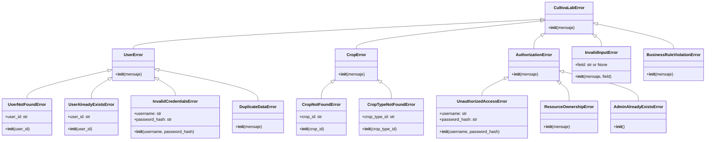

# **Jerarquía de Excepciones**

<p align="center">
  
</p>

<div align="center">
  
  
  
</div>

---

## **Visión General**

El manejo de errores en CultivaLab se basa en una jerarquía de excepciones personalizadas que permite capturar y tratar de forma específica cada tipo de situación anómala. Esta jerarquía facilita la depuración, el testing y la presentación de mensajes claros al usuario final.

Todas las excepciones heredan de la clase base <span style="color: #6dbc19;">`CultivaLabError`</span>, que a su vez hereda de la `Exception` estándar de Python. De esta forma, podemos capturar cualquier error propio de la aplicación de manera uniforme o bien tratar casos concretos según la necesidad.



---

## **Excepciones Base**

### **`CultivaLabError`**

Es la clase raíz de todas las excepciones del dominio. No se instancia directamente, sino que sirve como tipo genérico para capturar cualquier error conocido de la aplicación.

```python
class CultivaLabError(Exception):
    """Clase base para todas las excepciones de CultivaLab."""
    pass
```

---

## **Excepciones de Usuario (UserError)**

Agrupa todos los errores relacionados con la gestión de usuarios.

### **`UserNotFoundError`**

Se lanza cuando se intenta acceder a un usuario que no existe en el sistema (por ID o por nombre de usuario).

| Atributo | Tipo | Descripción |
|----------|------|-------------|
| `user_id` | `str` | Identificador del usuario que no se encontró |

**Ejemplo de uso:**
```python
if not user:
    raise UserNotFoundError(user_id)
```

### **`UserAlreadyExistsError`**

Se lanza al intentar registrar un usuario con un nombre de usuario que ya está ocupado.

| Atributo | Tipo | Descripción |
|----------|------|-------------|
| `user_id` | `str` | ID del usuario existente (para referencia) |

**Ejemplo de uso:**
```python
if self.storage.get_user_by_username(username):
    raise UserAlreadyExistsError(username)
```

### **`InvalidCredentialsError`**

Se lanza cuando las credenciales proporcionadas en el inicio de sesión no son correctas (usuario no existe o contraseña incorrecta).

| Atributo | Tipo | Descripción |
|----------|------|-------------|
| `username` | `str` | Nombre de usuario intentado |
| `password_hash` | `str` | Hash de la contraseña (para depuración, no se muestra) |

**Nota:** Aunque se incluye el hash, este nunca se expone al usuario final.

### **`DuplicateDataError`**

Se lanza cuando se intenta crear un elemento duplicado en situaciones donde no está permitido (por ejemplo, un tipo de cultivo con nombre ya existente).

| Atributo | Tipo | Descripción |
|----------|------|-------------|
| `message` | `str` | Mensaje descriptivo del error |

---

## **Excepciones de Cultivos (CropError)**

Agrupa errores relacionados con la gestión de cultivos.

### **`CropNotFoundError`**

Se lanza cuando se busca un cultivo por ID y este no existe.

| Atributo | Tipo | Descripción |
|----------|------|-------------|
| `crop_id` | `str` | Identificador del cultivo no encontrado |

### **`CropTypeNotFoundError`**

Se lanza cuando se hace referencia a un tipo de cultivo que no existe (por ejemplo, al crear un cultivo o al buscar estadísticas).

| Atributo | Tipo | Descripción |
|----------|------|-------------|
| `crop_type_id` | `str` | Identificador del tipo de cultivo no encontrado |

---

## **Excepciones de Autorización (AuthorizationError)**

Agrupa errores relacionados con permisos y acceso a recursos.

### **`UnauthorizedAccessError`**

Se lanza cuando un usuario intenta realizar una acción para la que no tiene privilegios (por ejemplo, un usuario normal intentando acceder a funciones de administrador).

| Atributo | Tipo | Descripción |
|----------|------|-------------|
| `username` | `str` | Nombre del usuario que intentó la acción |
| `password_hash` | `str` | Hash de la contraseña (no se muestra) |

### **`ResourceOwnershipError`**

Se lanza cuando un usuario intenta acceder o modificar un recurso (cultivo, perfil de otro usuario) que no le pertenece y no es administrador.

| Atributo | Tipo | Descripción |
|----------|------|-------------|
| `message` | `str` | Mensaje descriptivo del error |

### **`AdminAlreadyExistsError`**

Se lanza cuando se intenta registrar un segundo administrador, lo cual no está permitido por diseño (solo puede haber un administrador en el sistema).

| Atributo | Tipo | Descripción |
|----------|------|-------------|
| (ninguno) | | El mensaje es fijo: "El usuario administrador ya existe." |

---

## **Excepciones de Validación de Entrada**

### **`InvalidInputError`**

Se lanza cuando los datos proporcionados por el usuario no son válidos: valores fuera de rango, tipos incorrectos, campos vacíos, etc. Es una de las excepciones más utilizadas.

| Atributo | Tipo | Descripción |
|----------|------|-------------|
| `message` | `str` | Descripción del error |
| `field` | `str` o `None` | Nombre del campo que causó el error (opcional) |

**Ejemplos de uso:**
```python
if temperature > 56.7:
    raise InvalidInputError("La temperatura ingresada no es real.", field="temperature")

if not name or not name.strip():
    raise InvalidInputError("El nombre no puede estar vacío.")
```

---

## **Excepciones de Reglas de Negocio**

### **`BusinessRuleViolationError`**

Se lanza cuando se intenta realizar una operación que viola una regla de negocio fundamental. Por ejemplo, editar un tipo de cultivo que tiene cultivos activos, o eliminar un tipo que está siendo utilizado.

| Atributo | Tipo | Descripción |
|----------|------|-------------|
| `message` | `str` | Descripción de la regla violada |

**Ejemplo de uso:**
```python
if len(crops_using_crop_type) > 0:
    raise BusinessRuleViolationError(
        "No se puede editar este tipo porque hay cultivos activos que lo utilizan."
    )
```

---

## **Tabla Resumen de Excepciones**

| Excepción | Categoría | Cuándo se lanza |
|-----------|-----------|------------------|
| `UserNotFoundError` | Usuario | Usuario no encontrado por ID o username |
| `UserAlreadyExistsError` | Usuario | Registro con username duplicado |
| `InvalidCredentialsError` | Usuario | Credenciales incorrectas en login |
| `DuplicateDataError` | Usuario | Dato duplicado (ej. nombre de tipo de cultivo) |
| `CropNotFoundError` | Cultivo | Cultivo no encontrado por ID |
| `CropTypeNotFoundError` | Cultivo | Tipo de cultivo no encontrado |
| `UnauthorizedAccessError` | Autorización | Acción no permitida por rol |
| `ResourceOwnershipError` | Autorización | Acceso a recurso ajeno sin ser admin |
| `AdminAlreadyExistsError` | Autorización | Intento de crear segundo administrador |
| `InvalidInputError` | Validación | Datos de entrada inválidos |
| `BusinessRuleViolationError` | Negocio | Violación de regla de negocio |

---

## **Buenas Prácticas en el Manejo de Excepciones**

- **Captura específica:** Siempre que sea posible, captura la excepción más concreta en lugar de la genérica `CultivaLabError`.
- **Mensajes claros:** Las excepciones incluyen mensajes en español pensados para ser mostrados al usuario final.
- **Información contextual:** Las excepciones llevan atributos adicionales (IDs, nombres de campo) que ayudan en la depuración.
- **No exponer datos sensibles:** Aunque algunas excepciones contienen el hash de contraseña, nunca se muestra en la interfaz de usuario.

---

## **Ejemplo de Uso en la CLI**

```python
try:
    user = user_service.login(username, password)
except UserNotFoundError:
    console.print("El usuario no existe.")
except InvalidCredentialsError:
    console.print("Contraseña incorrecta.")
except AuthorizationError as e:
    console.print(f"Error de autorización: {e}")
```

Esta estructura permite un control fino del flujo de errores y una experiencia de usuario mucho más amigable.

---

## **Conclusión**

La jerarquía de excepciones de CultivaLab es un pilar fundamental del diseño robusto de la aplicación. Permite separar claramente los distintos tipos de errores, facilita el testing y garantiza que el usuario reciba mensajes adecuados ante cualquier situación inesperada. Además, su diseño extensible permite añadir nuevas excepciones en el futuro sin afectar el código existente.