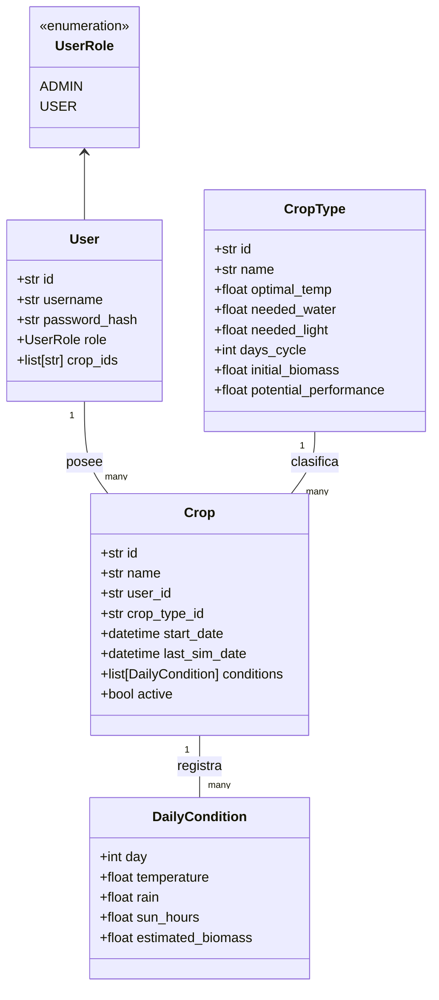
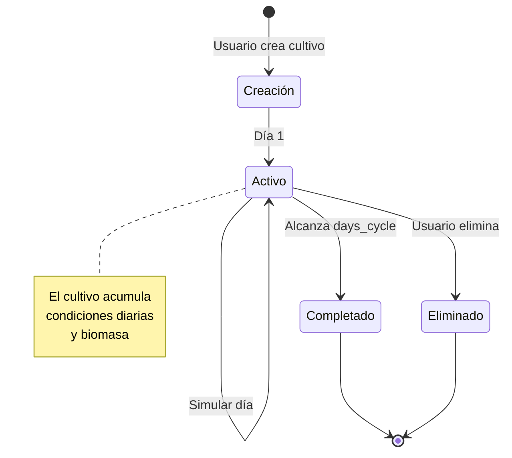

# **Modelos de Dominio**

<p align="center">
  
</p>

<div align="center">
  
  
  
</div>

---

## **Visión General de los Modelos**

Los modelos de dominio en CultivaLab representan las entidades fundamentales del sistema. Están implementados como <span style="color: #6dbc19;">**dataclasses**</span> inmutables, lo que garantiza que su estado no pueda modificarse accidentalmente y facilita la comprensión del flujo de datos a través de la aplicación.

Cada modelo encapsula atributos específicos y define las relaciones entre las distintas entidades. La capa de modelos es la única que conoce la estructura de los datos; las capas superiores (servicios y CLI) trabajan con instancias de estas clases sin preocuparse por cómo se almacenan o serializan.



---

## **Entidades del Dominio**

### **User (Usuario)**

La clase <span style="color: #6dbc19;">`User`</span> representa a una persona que interactúa con el sistema. Cada usuario tiene un identificador único, credenciales de acceso y un rol que determina sus permisos.

| Atributo | Tipo | Descripción |
|----------|------|-------------|
| `id` | `str` | Identificador único generado con UUID |
| `username` | `str` | Nombre de usuario único en el sistema |
| `password_hash` | `str` | Contraseña hasheada con bcrypt |
| `role` | `UserRole` | Rol del usuario (`ADMIN` o `USER`) |
| `crop_ids` | `list[str]` | Lista de IDs de los cultivos que posee |

**Relaciones:**

- Un usuario puede tener <span style="color: #6dbc19;">**muchos cultivos**</span> (relación 1:N).

- El rol determina las operaciones permitidas (por ejemplo, solo los administradores pueden gestionar tipos de cultivo).

**Validaciones implícitas:**

- El nombre de usuario debe ser único.

- Solo puede existir <span style="color: #6dbc19;">**un único administrador**</span> en todo el sistema.

- La contraseña se almacena hasheada, nunca en texto plano.

---

### **CropType (Tipo de Cultivo)**

La clase <span style="color: #6dbc19;">`CropType`</span> define las características genéticas y fisiológicas de una especie vegetal. Es gestionada exclusivamente por administradores y sirve como plantilla para crear cultivos concretos.

| Atributo | Tipo | Unidad | Descripción |
|----------|------|--------|-------------|
| `id` | `str` | - | Identificador único |
| `name` | `str` | - | Nombre del cultivo (ej. "Maíz", "Tomate") |
| `optimal_temp` | `float` | °C | Temperatura óptima para el crecimiento |
| `needed_water` | `float` | mm/día | Requerimiento hídrico diario |
| `needed_light` | `float` | horas/día | Horas de sol óptimas por día |
| `days_cycle` | `int` | días | Duración total del ciclo de cultivo |
| `initial_biomass` | `float` | g/m² | Biomasa al momento de la siembra |
| `potential_performance` | `float` | g/m² | Rendimiento máximo alcanzable |

**Relaciones:**

- Un tipo de cultivo puede tener <span style="color: #6dbc19;">**muchos cultivos**</span> asociados (relación 1:N).

- No se puede eliminar un tipo si existen cultivos (activos o inactivos) que lo referencien.

**Ejemplo de instancia:**
```python
maiz = CropType(
    id="123e4567-e89b-12d3-a456-426614174000",
    name="Maíz",
    optimal_temp=25.0,
    needed_water=5.0,
    needed_light=8.0,
    days_cycle=120,
    initial_biomass=10.0,
    potential_performance=1000.0
)
```

---

### **DailyCondition (Condición Diaria)**

La clase <span style="color: #6dbc19;">`DailyCondition`</span> representa el registro de un día específico en la vida de un cultivo. Incluye las condiciones ambientales ingresadas por el usuario y la biomasa calculada por el modelo de crecimiento.

| Atributo | Tipo | Unidad | Descripción |
|----------|------|--------|-------------|
| `day` | `int` | - | Número de día del cultivo (empieza en 1) |
| `temperature` | `float` | °C | Temperatura registrada |
| `rain` | `float` | mm | Cantidad de lluvia |
| `sun_hours` | `float` | horas | Horas de exposición solar |
| `estimated_biomass` | `float` | g/m² | Biomasa estimada para ese día |

**Características:**

- Es un <span style="color: #6dbc19;">**objeto valor**</span> inmutable: no tiene identidad propia y su igualdad se define por el contenido de sus atributos.

- Pertenece exclusivamente a un cultivo y no tiene sentido fuera de ese contexto.

**Ejemplo de instancia:**
```python
dia_15 = DailyCondition(
    day=15,
    temperature=26.5,
    rain=3.2,
    sun_hours=7.5,
    estimated_biomass=245.7
)
```

---

### **Crop (Cultivo)**

La clase <span style="color: #6dbc19;">`Crop`</span> es la entidad central del dominio. Representa un cultivo concreto que un usuario ha sembrado y está simulando. Contiene toda la información necesaria para seguir su evolución día a día.

| Atributo | Tipo | Descripción |
|----------|------|-------------|
| `id` | `str` | Identificador único |
| `name` | `str` | Nombre asignado por el usuario (ej. "Maíz parcela norte") |
| `user_id` | `str` | ID del usuario propietario |
| `crop_type_id` | `str` | ID del tipo de cultivo asociado |
| `start_date` | `datetime` | Fecha de siembra |
| `last_sim_date` | `datetime` | Última fecha en que se simuló un día |
| `conditions` | `list[DailyCondition]` | Historial completo de condiciones diarias |
| `active` | `bool` | Indica si el cultivo sigue en crecimiento |

**Relaciones:**

- Pertenece a un <span style="color: #6dbc19;">**usuario**</span> (relación N:1).

- Tiene un <span style="color: #6dbc19;">**tipo de cultivo**</span> asociado (relación N:1).

- Contiene <span style="color: #6dbc19;">**muchas condiciones diarias**</span> (relación 1:N).

**Reglas de negocio implícitas:**

- Un cultivo solo puede ser simulado si está <span style="color: #6dbc19;">`active = True`</span>.

- Al alcanzar `days_cycle` días simulados, pasa automáticamente a `active = False`.

- La biomasa nunca puede superar `potential_performance` del tipo asociado.

**Ejemplo de instancia:**
```python
mi_maiz = Crop(
    id="crop-001",
    name="Maíz experimental",
    user_id="user-123",
    crop_type_id="maiz-type",
    start_date=datetime(2024, 3, 1),
    last_sim_date=datetime(2024, 3, 15),
    conditions=[dia_1, dia_2, ..., dia_15],
    active=True
)
```

---

## **Relaciones entre Entidades**

El diagrama de clases presentado anteriormente muestra las relaciones fundamentales:

1. **Usuario ↔ Cultivo**: Relación de uno a muchos. Un usuario puede tener múltiples cultivos, pero cada cultivo pertenece a un único usuario. Esta relación se implementa mediante el campo <span style="color: #6dbc19;">`user_id`</span> en la clase `Crop` y la lista <span style="color: #6dbc19;">`crop_ids`</span> en `User` para facilitar búsquedas inversas.

2. **Tipo de Cultivo ↔ Cultivo**: Relación de uno a muchos. Un tipo de cultivo puede ser la plantilla para muchos cultivos concretos, pero cada cultivo tiene exactamente un tipo. Se implementa mediante <span style="color: #6dbc19;">`crop_type_id`</span> en `Crop`.

3. **Cultivo ↔ Condición Diaria**: Relación de composición. Un cultivo contiene muchas condiciones diarias, y cada condición pertenece exclusivamente a un cultivo. Las condiciones no tienen sentido fuera del contexto del cultivo.

4. **Usuario ↔ Rol**: Relación de asignación. Cada usuario tiene un rol (`ADMIN` o `USER`) que determina sus permisos en el sistema.

---

## **Ciclo de Vida de los Modelos**



El ciclo de vida típico de un cultivo comienza con su creación por parte de un usuario. En ese momento, el cultivo está vacío (sin condiciones) y activo. Cada simulación diaria añade una nueva `DailyCondition` y actualiza la biomasa. Cuando el número de días simulados iguala la duración del ciclo (`days_cycle`), el cultivo pasa automáticamente a estado <span style="color: #6dbc19;">`completado`</span>. En cualquier momento, el usuario puede eliminar el cultivo, lo que lo remueve permanentemente del sistema.

---

## **Consideraciones de Diseño**

### **Inmutabilidad**
Las dataclasses se definen con <span style="color: #6dbc19;">`frozen=True`</span> implícitamente (aunque no se use el decorador, en la práctica se tratan como inmutables). Esto significa que una vez creadas, las instancias no pueden modificarse. Cualquier cambio requiere crear una nueva instancia, lo que facilita el razonamiento sobre el flujo de datos y previene efectos secundarios no deseados.

### **Identificadores Únicos**
Todos los identificadores (`id` en `User`, `Crop`, `CropType`) se generan como <span style="color: #6dbc19;">**UUID**</span> (identificadores únicos universales) para garantizar que no haya colisiones, incluso en sistemas distribuidos.

### **Separación de Responsabilidades**
Los modelos no contienen lógica de negocio. No saben cómo se persisten, cómo se validan ni cómo se relacionan con otros objetos en términos de reglas de la aplicación. Su única responsabilidad es representar el estado y las relaciones estructurales.

### **Tipado Fuerte**
Todos los atributos tienen anotaciones de tipo, lo que permite a `mypy` verificar estáticamente que se usan correctamente y facilita la documentación automática con `mkdocstrings`.

---

## **Ejemplos de Uso en la Aplicación**

### **Creación de un nuevo cultivo**
Cuando un usuario crea un cultivo, el servicio `CropService` instancia la clase `Crop` con los datos proporcionados:

```python
nuevo_cultivo = Crop(
    id=str(uuid.uuid4()),
    name=nombre_usuario,
    user_id=usuario.id,
    crop_type_id=tipo_cultivo.id,
    start_date=datetime.now(),
    last_sim_date=datetime.now(),
    conditions=[],
    active=True
)
```

### **Registro de una condición diaria**
Al simular un día, se crea una nueva `DailyCondition` y se añade a la lista del cultivo:

```python
nueva_condicion = DailyCondition(
    day=len(cultivo.conditions) + 1,
    temperature=temperatura,
    rain=lluvia,
    sun_hours=horas_sol,
    estimated_biomass=nueva_biomasa
)

cultivo.conditions.append(nueva_condicion)
cultivo.last_sim_date = datetime.now()
```

---

## **Conclusión**

Los modelos de dominio de CultivaLab constituyen la base sobre la que se construye toda la aplicación. Su diseño simple pero expresivo, combinado con el uso de dataclasses y tipado fuerte, proporciona una base sólida para la lógica de negocio implementada en los servicios. La separación clara entre estado y comportamiento facilita el mantenimiento, las pruebas y la evolución futura del sistema.