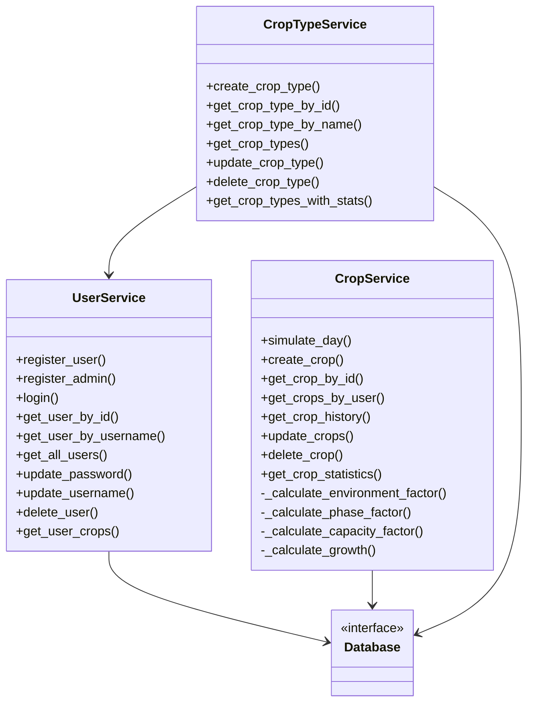
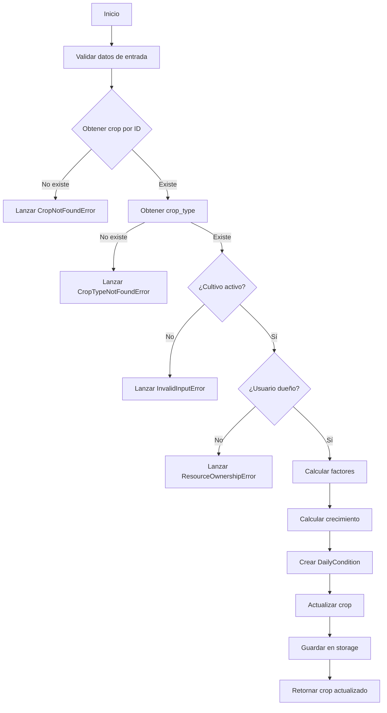

# **Capa de Servicios**

  

  
  
  

---

## **Visión General de los Servicios**

La capa de servicios constituye el **corazón de la lógica de negocio** de CultivaLab. Aquí se implementan todas las reglas y validaciones que garantizan el correcto funcionamiento de la aplicación, actuando como intermediario entre la interfaz de usuario (CLI) y la capa de persistencia (storage).

Los servicios están organizados en tres clases principales, cada una responsable de un área de dominio específica:

- **`UserService`**: Gestiona todo lo relacionado con usuarios: registro, autenticación, actualización de perfiles y eliminación de cuentas.
- **`CropService`**: Maneja la creación, simulación, consulta y eliminación de cultivos, así como el modelo matemático de crecimiento.
- **`CropTypeService`**: Administra el catálogo de tipos de cultivo, exclusivo para administradores.

---

## **Principios de Diseño Comunes**

Todos los servicios comparten las siguientes características:

- **Validación exhaustiva**: Cada método público valida los parámetros de entrada y lanza excepciones personalizadas cuando se violan reglas de negocio.
- **Control de acceso**: Se verifica que el usuario que realiza la operación tenga los permisos necesarios (por ejemplo, solo el propietario de un cultivo puede modificarlo).
- **Separación de responsabilidades**: Los servicios no conocen los detalles de persistencia; dependen de la abstracción `Database` definida en `storage.py`.
- **Manejo de errores**: Las excepciones se capturan en la capa superior (CLI) para mostrar mensajes amigables al usuario.

---

## **UserService**

Responsable de la gestión de usuarios, incluyendo autenticación y perfiles.

### **Métodos Principales**

| Método | Descripción | Parámetros | Retorno | Excepciones |
|--------|-------------|------------|---------|-------------|
| `register_user` | Registra un nuevo usuario con rol `USER` | `username: str`, `password: str` | `User` | `InvalidInputError`, `UserAlreadyExistsError` |
| `register_admin` | Registra el único administrador del sistema (requiere clave maestra) | `admin_key: str`, `username: str`, `password: str` | `User` | `InvalidInputError`, `AdminAlreadyExistsError`, `UserAlreadyExistsError` |
| `login` | Autentica un usuario por nombre y contraseña | `username: str`, `password: str` | `User` | `InvalidInputError`, `UserNotFoundError`, `AuthorizationError` |
| `get_user_by_id` | Obtiene un usuario por su ID (solo el propio usuario o admin) | `user_id: str`, `requesting_user_id: str` | `User` o `None` | `InvalidInputError`, `UserNotFoundError`, `ResourceOwnershipError` |
| `get_user_by_username` | Obtiene un usuario por su nombre (solo propio o admin) | `username: str`, `requesting_user_id: str` | `User` | `InvalidInputError`, `UserNotFoundError`, `ResourceOwnershipError` |
| `get_all_users` | Lista todos los usuarios (solo admin) | `requesting_user_id: str` | `list[User]` | `InvalidInputError`, `UserNotFoundError`, `ResourceOwnershipError` |
| `update_password` | Cambia la contraseña de un usuario (solo propio) | `user_id: str`, `old_password: str`, `new_password: str` | `None` | `InvalidInputError`, `UserNotFoundError`, `AuthorizationError` |
| `update_username` | Cambia el nombre de usuario (solo propio) | `user_id: str`, `new_username: str`, `requesting_user_id: str` | `None` | `InvalidInputError`, `UserNotFoundError`, `ResourceOwnershipError`, `UserAlreadyExistsError` |
| `delete_user` | Elimina una cuenta de usuario (solo propio o admin) | `user_id: str`, `requesting_user_id: str` | `None` | `InvalidInputError`, `UserNotFoundError`, `ResourceOwnershipError` |
| `get_user_crops` | Obtiene los cultivos de un usuario (solo propio o admin) | `user_id: str`, `requesting_user_id: str` | `list[Crop]` | `InvalidInputError`, `UserNotFoundError`, `ResourceOwnershipError` |

### **Detalles de Implementación**

- Las contraseñas se almacenan utilizando **bcrypt**, garantizando que nunca se guardan en texto plano.
- El administrador es único: el método `register_admin` verifica que no exista ya un usuario con rol `ADMIN` antes de crear uno nuevo.
- La clave maestra para registrar admin está hardcodeada como `MASTER_KEY = "admin12345"` (modificable en el código).

---

## **CropService**

Gestiona la creación, simulación y consulta de cultivos. Contiene el modelo matemático de crecimiento.

### **Métodos Principales**

| Método | Descripción | Parámetros | Retorno | Excepciones |
|--------|-------------|------------|---------|-------------|
| `simulate_day` | Simula un día de crecimiento para un cultivo | `crop_id: str`, `user_id: str`, `temperature: float`, `rain: float`, `sun_hours: float` | `Crop` | `InvalidInputError`, `CropNotFoundError`, `CropTypeNotFoundError`, `ResourceOwnershipError` |
| `create_crop` | Crea un nuevo cultivo para un usuario | `name: str`, `crop_type_id: str`, `user_id: str`, `start_date: datetime` | `Crop` | `UserNotFoundError`, `CropTypeNotFoundError`, `InvalidInputError` |
| `get_crop_by_id` | Obtiene un cultivo por su ID (solo propio o admin) | `crop_id: str`, `requesting_user_id: str` | `Crop` | `UserNotFoundError`, `CropNotFoundError`, `ResourceOwnershipError` |
| `get_crops_by_user` | Lista cultivos de un usuario (solo propio o admin) | `user_id: str`, `requesting_user_id: str` | `list[Crop]` | `UserNotFoundError`, `ResourceOwnershipError` |
| `get_crop_history` | Retorna el historial de condiciones de un cultivo | `crop_id: str`, `requesting_user_id: str` | `list[DailyCondition]` | `UserNotFoundError`, `CropNotFoundError`, `ResourceOwnershipError` |
| `update_crops` | Actualiza campos permitidos de un cultivo (nombre, activo) | `crop_id: str`, `requesting_user_id: str`, `**kwargs` | `Crop` | `UserNotFoundError`, `CropNotFoundError`, `ResourceOwnershipError`, `InvalidInputError` |
| `delete_crop` | Elimina un cultivo (solo propio o admin) | `crop_id: str`, `requesting_user_id: str` | `None` | `UserNotFoundError`, `CropNotFoundError`, `ResourceOwnershipError` |
| `get_crop_statistics` | Calcula estadísticas de un cultivo | `crop_id: str`, `requesting_user_id: str` | `dict` | `UserNotFoundError`, `CropNotFoundError`, `ResourceOwnershipError`, `CropTypeNotFoundError` |

### **Modelo de Crecimiento (Métodos Privados)**

| Método | Descripción |
|--------|-------------|
| `_calculate_environment_factor` | Calcula un factor combinado a partir de temperatura, agua y luz, comparándolos con los valores óptimos del tipo de cultivo. |
| `_calculate_phase_factor` | Determina un factor basado en la etapa fenológica del cultivo (inicio, crecimiento, maduración). |
| `_calculate_capacity_factor` | Evalúa la capacidad remanente de crecimiento en función de la biomasa actual y el rendimiento potencial. |
| `_calculate_growth` | Combina los tres factores anteriores con una tasa base para obtener el incremento de biomasa del día. |

### **Flujo de Simulación**

1. Validaciones de entrada (rangos de temperatura, lluvia, horas de sol).
2. Verificación de que el cultivo existe, está activo y pertenece al usuario.
3. Obtención del tipo de cultivo asociado.
4. Cálculo de los factores ambientales, fenológicos y de capacidad.
5. Cálculo del crecimiento y la nueva biomasa.
6. Creación de una nueva `DailyCondition` y actualización del cultivo.
7. Persistencia del cultivo actualizado.

---

## **CropTypeService**

Administra el catálogo de tipos de cultivo, accesible únicamente por administradores.

### **Métodos Principales**

| Método | Descripción | Parámetros | Retorno | Excepciones |
|--------|-------------|------------|---------|-------------|
| `create_crop_type` | Crea un nuevo tipo de cultivo | `admin_id: str`, `name: str`, `optimal_temp: float`, `needed_water: float`, `needed_light: float`, `days_cycle: int`, `initial_biomass: float`, `potential_performance: float` | `CropType` | `InvalidInputError`, `UserNotFoundError`, `ResourceOwnershipError`, `DuplicateDataError` |
| `get_crop_type_by_id` | Obtiene un tipo por su ID | `crop_type_id: str` | `CropType` | `InvalidInputError`, `CropTypeNotFoundError` |
| `get_crop_type_by_name` | Obtiene un tipo por su nombre | `crop_type_name: str` | `CropType` | `InvalidInputError`, `CropTypeNotFoundError` |
| `get_crop_types` | Lista todos los tipos disponibles | - | `list[CropType]` | - |
| `update_crop_type` | Actualiza atributos de un tipo (solo admin, sin cultivos activos) | `admin_id: str`, `crop_type_id: str`, `**kwargs` | `CropType` | `InvalidInputError`, `UserNotFoundError`, `ResourceOwnershipError`, `CropTypeNotFoundError`, `BusinessRuleViolationError` |
| `delete_crop_type` | Elimina un tipo (solo si no tiene cultivos activos) | `admin_id: str`, `crop_type_to_eliminate_id: str` | `None` | `InvalidInputError`, `UserNotFoundError`, `ResourceOwnershipError`, `CropTypeNotFoundError`, `BusinessRuleViolationError` |
| `get_crop_types_with_stats` | Retorna estadísticas de uso por tipo (solo admin) | `admin_id: str` | `list[dict]` | `InvalidInputError`, `UserNotFoundError`, `ResourceOwnershipError` |

### **Reglas de Negocio Específicas**

- No se puede eliminar un tipo de cultivo si existen cultivos **activos** que lo utilicen (los cultivos inactivos o cosechados sí permiten la eliminación).
- No se puede modificar un tipo si hay cultivos activos asociados.
- El nombre del tipo debe ser único y se normaliza (capitalización).
- Todos los valores numéricos (excepto temperatura) deben ser positivos.

---

## **Interacción entre Servicios**

Los servicios no operan de forma aislada; existen dependencias claras:

- `CropTypeService` requiere una instancia de `UserService` para verificar que quien realiza operaciones es realmente administrador (aunque también consulta el storage directamente).
- `CropService` utiliza `UserService` implícitamente a través del storage para validar propiedades de usuarios.
- Todos los servicios dependen de la abstracción `Database`, que inyectamos en el constructor.

Esta arquitectura permite un acoplamiento débil y facilita las pruebas unitarias mediante mocking.

---

## **Validaciones y Excepciones**

Cada método de servicio puede lanzar excepciones personalizadas que reflejan errores específicos del dominio. La jerarquía completa se describe en la sección de [excepciones](exceptions.md). Algunas de las más utilizadas son:

- **`InvalidInputError`**: Datos de entrada incorrectos (valores fuera de rango, tipos erróneos).
- **`ResourceOwnershipError`**: Intento de acceder o modificar un recurso que no pertenece al usuario.
- **`BusinessRuleViolationError`**: Violación de una regla de negocio (ej. editar un tipo con cultivos activos).
- **`CropNotFoundError`**, **`UserNotFoundError`**, **`CropTypeNotFoundError`**: Entidades no encontradas.

---

## **Conclusión**

La capa de servicios de CultivaLab encapsula toda la complejidad de la lógica de negocio, ofreciendo una interfaz clara y coherente a la CLI. Su diseño modular y basado en principios SOLID garantiza que el sistema sea mantenible, testeable y extensible. La separación entre servicios, modelos y persistencia permite que futuras mejoras (como un nuevo modelo de crecimiento o una API web) se implementen con el mínimo impacto en el código existente.