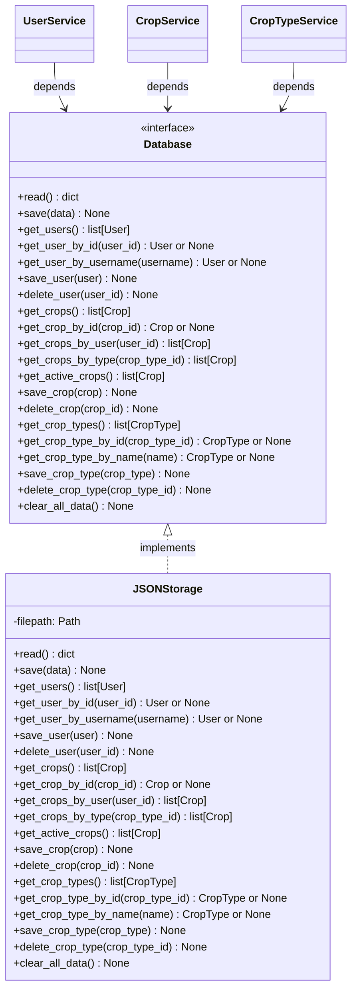

# **Capa de Persistencia (Storage)**

<p align="center">
  
</p>

<div align="center">
  
  
  
</div>

---

## **Visión General de la Persistencia**

La capa de persistencia en CultivaLab sigue el <span style="color: #6dbc19;">**patrón Repository**</span> y está diseñada aplicando el <span style="color: #6dbc19;">**Principio de Inversión de Dependencias (DIP)**</span>. Esto significa que las capas superiores (servicios) dependen de una abstracción, no de una implementación concreta, lo que permite cambiar el mecanismo de almacenamiento sin modificar la lógica de negocio.



---

## **El Protocolo Database**

El protocolo <span style="color: #6dbc19;">`Database`</span> define el contrato que cualquier implementación de almacenamiento debe cumplir. Esto permite que en el futuro se puedan crear nuevas implementaciones (por ejemplo, con <span style="color: #6dbc19;">**SQLite**</span>, <span style="color: #6dbc19;">**PostgreSQL**</span> o <span style="color: #6dbc19;">**Supabase**</span>) sin necesidad de modificar los servicios.

### **Métodos del Protocolo**

#### **Operaciones Generales**

| Método | Descripción | Parámetros | Retorno |
|--------|-------------|------------|---------|
| `read()` | Lee el archivo completo y retorna su contenido como diccionario | - | `dict[str, list]` |
| `save(data)` | Guarda el diccionario completo en el almacenamiento | `data: dict[str, list]` | `None` |
| `clear_all_data()` | Elimina todos los datos (útil para testing) | - | `None` |

#### **Operaciones con Usuarios**

| Método | Descripción | Parámetros | Retorno |
|--------|-------------|------------|---------|
| `get_users()` | Retorna todos los usuarios | - | `list[User]` |
| `get_user_by_id(user_id)` | Busca un usuario por su ID | `user_id: str` | `User \| None` |
| `get_user_by_username(username)` | Busca un usuario por su nombre | `username: str` | `User \| None` |
| `save_user(user)` | Guarda un usuario (crea o actualiza) | `user: User` | `None` |
| `delete_user(user_id)` | Elimina un usuario por su ID | `user_id: str` | `None` |

#### **Operaciones con Cultivos**

| Método | Descripción | Parámetros | Retorno |
|--------|-------------|------------|---------|
| `get_crops()` | Retorna todos los cultivos | - | `list[Crop]` |
| `get_crop_by_id(crop_id)` | Busca un cultivo por su ID | `crop_id: str` | `Crop \| None` |
| `get_crops_by_user(user_id)` | Retorna cultivos de un usuario específico | `user_id: str` | `list[Crop]` |
| `get_crops_by_type(crop_type_id)` | Retorna cultivos de un tipo específico | `crop_type_id: str` | `list[Crop]` |
| `get_active_crops()` | Retorna solo cultivos activos | - | `list[Crop]` |
| `save_crop(crop)` | Guarda un cultivo (crea o actualiza) | `crop: Crop` | `None` |
| `delete_crop(crop_id)` | Elimina un cultivo por su ID | `crop_id: str` | `None` |

#### **Operaciones con Tipos de Cultivo**

| Método | Descripción | Parámetros | Retorno |
|--------|-------------|------------|---------|
| `get_crop_types()` | Retorna todos los tipos de cultivo | - | `list[CropType]` |
| `get_crop_type_by_id(crop_type_id)` | Busca un tipo por su ID | `crop_type_id: str` | `CropType \| None` |
| `get_crop_type_by_name(name)` | Busca un tipo por su nombre | `name: str` | `CropType \| None` |
| `save_crop_type(crop_type)` | Guarda un tipo de cultivo (crea o actualiza) | `crop_type: CropType` | `None` |
| `delete_crop_type(crop_type_id)` | Elimina un tipo por su ID | `crop_type_id: str` | `None` |

---

## **JSONStorage: Implementación Concreta**

La implementación actual utiliza un archivo <span style="color: #6dbc19;">**JSON**</span> como almacenamiento persistente. La clase `JSONStorage` implementa el protocolo `Database` y maneja toda la lógica de serialización, deserialización y reconstrucción de objetos.

### **Estructura del Archivo**

El archivo <span style="color: #6dbc19;">`data/database.json`</span> tiene la siguiente estructura:

```json
{
  "users": [
    {
      "id": "uuid",
      "username": "ejemplo",
      "password_hash": "$2b$12$...",
      "role": "user",
      "crop_ids": ["crop-123"]
    }
  ],
  "crops": [
    {
      "id": "crop-123",
      "name": "Mi cultivo",
      "user_id": "uuid",
      "crop_type_id": "type-456",
      "start_date": "2024-03-01T00:00:00",
      "last_sim_date": "2024-03-15T00:00:00",
      "conditions": [
        {
          "day": 1,
          "temperature": 25.0,
          "rain": 5.0,
          "sun_hours": 8.0,
          "estimated_biomass": 12.5
        }
      ],
      "active": true
    }
  ],
  "crop_types": [
    {
      "id": "type-456",
      "name": "Maíz",
      "optimal_temp": 25.0,
      "needed_water": 5.0,
      "needed_light": 8.0,
      "days_cycle": 120,
      "initial_biomass": 10.0,
      "potential_performance": 1000.0
    }
  ]
}
```

### **Métodos Fundamentales**

#### **`read()`**

```python
def read(self) -> dict[str, list]:
    if not self.filepath.exists():
        return {"users": [], "crops": [], "crop_types": []}
    
    with open(self.filepath, "r") as f:
        db = json.load(f)
    return {
        "users": db.get("users", []),
        "crops": db.get("crops", []),
        "crop_types": db.get("crop_types", []),
    }
```

**Comportamiento:**
- Si el archivo no existe, retorna una estructura vacía.

- Si existe, lee el contenido y retorna un diccionario con las tres secciones.

- Maneja archivos corruptos lanzando excepciones que deben ser capturadas por el llamante.

#### **`save(data)`**

```python
def save(self, data: dict[str, list]) -> None:
    with open(self.filepath, "w") as f:
        json.dump(data, f, indent=4, ensure_ascii=False)
```

- Guarda el diccionario completo con formato legible (indentación de 4 espacios).

- Sobrescribe completamente el archivo anterior.

---

## **Patrón de Reconstrucción de Objetos**

Uno de los aspectos más importantes de `JSONStorage` es cómo reconstruye los objetos de dominio a partir de los diccionarios almacenados.

### **Reconstrucción de Usuarios**

```python
def get_users(self) -> list[User]:
    users = self.read().get("users", [])
    users_list = []

    for user in users:
        user_data = user.copy()
        user_data["role"] = UserRole(user["role"])
        users_list.append(User(**user_data))

    return users_list
```

- El campo `role` (string) se convierte al Enum <span style="color: #6dbc19;">`UserRole`</span>.

- El resto de atributos se pasan directamente al constructor de `User`.

### **Reconstrucción de Cultivos**

```python
def get_crops(self) -> list[Crop]:
    crops = self.read().get("crops", [])
    crops_list = []

    for crop in crops:
        crop_data = crop.copy()
        
        # Reconstruir condiciones diarias
        conditions_raw = crop_data.get("conditions", [])
        conditions_list = []
        for cond in conditions_raw:
            conditions_list.append(DailyCondition(**cond))
        crop_data["conditions"] = conditions_list
        
        # Reconstruir fechas
        crop_data["start_date"] = datetime.fromisoformat(crop_data["start_date"])
        crop_data["last_sim_date"] = datetime.fromisoformat(crop_data["last_sim_date"])
        
        crops_list.append(Crop(**crop_data))

    return crops_list
```

- Las condiciones diarias se reconstruyen recursivamente.

- Las fechas en formato ISO string se convierten a objetos <span style="color: #6dbc19;">`datetime`</span>.

### **Reconstrucción de Tipos de Cultivo**

```python
def get_crop_types(self) -> list[CropType]:
    crop_types = self.read().get("crop_types", [])
    crop_types_list = []

    for crop_type in crop_types:
        crop_type_data = crop_type.copy()
        crop_types_list.append(CropType(**crop_type_data))

    return crop_types_list
```

- Los tipos de cultivo no requieren transformaciones complejas, ya que todos sus campos son tipos básicos.

---

## **Patrón de Guardado (Upsert)**

Todos los métodos `save_*` siguen el mismo patrón:

1. Leer el archivo completo.
2. Buscar si el elemento ya existe por su ID.
3. Si existe, reemplazarlo en la lista.
4. Si no existe, agregarlo al final.
5. Guardar el archivo completo.

```python
def save_user(self, user: User) -> None:
    data = self.read()
    users = data["users"]
    user_dict = asdict(user)
    user_dict["role"] = user.role.value  # Convertir Enum a string

    for i, u in enumerate(users):
        if user_dict["id"] == u["id"]:
            users[i] = user_dict  # Reemplazar (update)
            self.save(data)
            return
        
    users.append(user_dict)  # Agregar (create)
    self.save(data)
```

Este enfoque garantiza que las operaciones sean atómicas a nivel de archivo y mantengan la consistencia de los datos.

---

## **Ventajas del Diseño**

### **1. Abstracción y Flexibilidad**

El uso del protocolo `Database` permite cambiar la implementación sin afectar las capas superiores. Por ejemplo, para migrar a <span style="color: #6dbc19;">**SQLite**</span>:

```python
class SQLiteDatabase(Database):
    def __init__(self, db_path: str):
        self.connection = sqlite3.connect(db_path)
    
    def get_users(self) -> list[User]:
        cursor = self.connection.execute("SELECT * FROM users")
        # ... transformar filas a objetos User
```

### **2. Persistencia Sencilla**

JSON es legible por humanos, no requiere configuración de bases de datos y es ideal para aplicaciones de escritorio y prototipos.

### **3. Consistencia de Datos**

Al guardar todo el archivo en cada operación, se evitan problemas de concurrencia y se garantiza que el archivo siempre esté en un estado válido (aunque no es eficiente para grandes volúmenes de datos).

### **4. Facilidad de Testing**

Se puede crear una implementación en memoria del protocolo `Database` para pruebas unitarias, o usar el `JSONStorage` con archivos temporales.

---

## **Ejemplo de Uso en Servicios**

```python
# Inicialización
storage = JSONStorage()
user_service = UserService(storage)
crop_service = CropService(storage)

# Uso desde servicios
usuarios = user_service.get_all_users(admin_id)
cultivos = crop_service.get_crops_by_user(user_id, requesting_user_id)
```

Los servicios nunca interactúan directamente con el archivo JSON; siempre lo hacen a través de la abstracción.

---

## **Limitaciones y Consideraciones**

- **Escalabilidad**: JSON no es adecuado para aplicaciones con muchos usuarios o cultivos debido a que debe leer y escribir el archivo completo en cada operación.

- **Concurrencia**: No maneja accesos simultáneos; en entornos multi-usuario podría haber conflictos.

- **Búsquedas**: Las búsquedas por atributos no indexados requieren iterar sobre todas las entidades.

Estas limitaciones son aceptables para el ámbito académico y para aplicaciones de escritorio con pocos usuarios. Para una futura versión web, se recomienda migrar a una base de datos SQL.

---

## **Conclusión**

La capa de persistencia de CultivaLab demuestra una aplicación sólida de principios de diseño como la inversión de dependencias y el patrón repositorio. La implementación actual con JSONStorage es suficiente para los requisitos del proyecto y proporciona una base clara para futuras mejoras, como la migración a bases de datos más robustas o servicios en la nube.